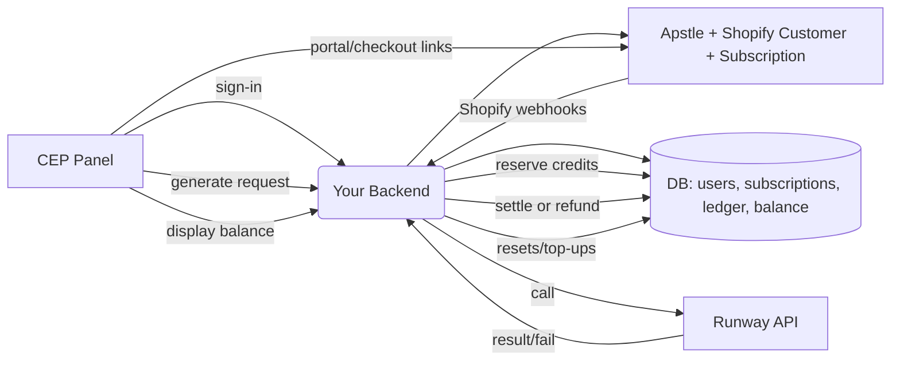

# CEP Licensing & Credits — Apstle Subscriptions + Runway

A production-ready blueprint to sell subscription tiers, handle monthly credit resets, and offer instant top-ups for a CEP extension that calls Runway for generations.

> **TL;DR**
> - Use **Apstle Subscriptions** (Shopify app) as the subscription management system.
> - Model **3 selling plan tiers** + **2 Shopify top‑up products**.
> - Treat your **backend as the source of truth** for credits and usage.
> - **Grant base credits** on each successful renewal via Shopify `orders/paid` webhooks.
> - **Top-ups** are applied immediately on Shopify `orders/paid` webhook for top-up SKUs.
> - **1 credit = 5 seconds** of generation. Reserve on start, settle/refund on completion.
> - Optional: Add **one-off charges** to subscription contracts for overage billing.

---

## Plans & Credit Math

| Tier | Price / mo | Credits / mo | Est. Runway cost to you | Notes |
|---|---:|---:|---:|---|
| Tier 1 | $49 | 1,000 | ~$10 | 1 credit = 5 sec ⇒ ~5,000 sec (~83.3 min) |
| Tier 2 | $79 | 2,500 | ~$25 | ~12,500 sec (~208.3 min) |
| Tier 3 | $199 | 8,000 | ~$80 | ~40,000 sec (~666.7 min) |

**Top-ups (one-time purchases)**
- +1,000 credits — $30 (Shopify product)
- +2,000 credits — $50 (Shopify product)

**Conversion**: `credits = ceil(seconds / 5)` and `seconds = credits * 5`.

> Credits reset **every 30 days** based on subscription renewal. Use Apstle contract billing cycles to mark the window.

---

## High-Level Architecture



**Principles**
- Keep **all credit math** in your backend.
- The panel trusts only **server-reported balances**.
- Use **idempotent** webhook handlers and **transactional** ledger updates.

---

## Apstle + Shopify Configuration

1. **Apstle Selling Plan Groups**: Create subscription tiers
   - Selling Plan A: Tier 1 — $49/mo
   - Selling Plan B: Tier 2 — $79/mo  
   - Selling Plan C: Tier 3 — $199/mo
2. **Shopify Products** (separate one-time products):
   - Top-up 1: +1,000 credits — $30
   - Top-up 2: +2,000 credits — $50
3. **(Optional)** Add **one-off charges** via Apstle's `subscription-contract-one-offs` endpoints to auto-bill excess usage at renewal.
4. **Customer Portal**: Apstle provides `manage-subscription-link` for upgrades/downgrades, payment method updates, cancel/pause.
5. **(Optional)** License keys: enable if you want device-level activation/offline gating inside the CEP panel.

**Shopify Webhooks to subscribe to**
- `orders/paid` *(use this as the reset trigger for subscription orders)*
- `orders/paid` *(use this for immediate top-up credit grants)*
- `orders/create` *(optional backup)*

**Optional Apstle Polling**
- Poll `GET /api/external/v2/subscription-billing-attempts/past-orders` as fallback for missed webhooks

> Verify Shopify webhook signatures, store delivery ids, and make handlers idempotent.

---

## Data Model (minimal)

```sql
-- users
id uuid pk,
email text unique,
shopify_customer_id text unique,
created_at timestamptz

-- subscriptions (one row per active Apstle contract)
id uuid pk,
user_id uuid fk users(id),
apstle_contract_id text unique,
selling_plan_id text,
current_period_start timestamptz,
current_period_end timestamptz,
status text, -- active/paused/cancelled/expired
created_at timestamptz,
updated_at timestamptz

-- credit_ledger (append-only)
id uuid pk,
user_id uuid fk users(id),
delta int,                 -- +credits or -credits
event_type text,           -- CREDIT_BASE_RESET, CREDIT_TOPUP, DEBIT_JOB_RESERVE, CREDIT_JOB_REFUND, CREDIT_JOB_FAIL, etc.
reason text,
ext_ref jsonb,             -- {subId, orderId, taskId, webhookId, etc.}
created_at timestamptz

-- credit_balance (cached)
user_id uuid pk,
balance int,               -- derived from ledger
updated_at timestamptz

-- reservations (optional but recommended for clarity)
id uuid pk,
user_id uuid,
task_id text,              -- your Runway task id
reserved_credits int,
status text,               -- open/closed
created_at timestamptz
```

**Derived balance**: `sum(delta)` over `credit_ledger` per user, cached in `credit_balance` and updated in the same transaction whenever you write to the ledger.

---

## Backend Flows

### 1) Monthly Reset on Renewal
- Trigger: `subscription_payment_success`
- Steps:
  1. Upsert subscription row; set `current_period_start/end`.
  2. Determine base credits by `ls_variant_id` (1,000 | 2,500 | 8,000).
  3. Append `credit_ledger` with `CREDIT_BASE_RESET` and `+base`.
  4. Update `credit_balance`.

### 2) Top-up Application
- Trigger: `order_created` for a top-up product.
- Steps:
  1. Verify product/variant is a known top-up.
  2. Append ledger with `CREDIT_TOPUP` and credits amount.
  3. Update `credit_balance`.

### 3) Start Generation (Reserve)
- Input: `requested_seconds`.
- Compute `needed = ceil(requested_seconds / 5)`.
- Transaction:
  - `SELECT ... FOR UPDATE` current `credit_balance`.
  - If `balance < needed` → 402 with actionable error.
  - Append `DEBIT_JOB_RESERVE` `-needed`; insert `reservations(open)` with `taskId`.
  - Update `credit_balance`.
- Call Runway; store `taskId`.

### 4) Finalize Generation (Settle/Refund)
- When Runway task completes:
  - If **failed**: refund full reserve via `CREDIT_JOB_FAIL`, close reservation.
  - If **succeeded**:
    - Determine `actual_seconds` (from request or result).
    - `used = ceil(actual_seconds / 5)`.
    - `refund = max(0, reserved - used)`. If `refund > 0`, write `CREDIT_JOB_REFUND`.
    - Close reservation.

---

## Upgrade/Downgrade Rules

- **Upgrade mid-cycle:** grant **prorated extra base credits**:
  ```
  extraMonthly = newBase - oldBase
  bonus = ceil(extraMonthly * remainingDays / cycleDays)
  ```
  Then append `CREDIT_TIER_UPGRADE_BONUS = +bonus`.
- **Downgrade:** apply the lower base at the **next** renewal; no clawback.

---

## Public API (suggested)

```
GET    /v1/me                         -> { user, subscription, cycle:{start,end}, balance }
GET    /v1/credits                    -> { balance, cycle:{start,end} }
POST   /v1/jobs                       -> { requestedSeconds } -> { taskId, reservedCredits }
GET    /v1/jobs/:taskId               -> { status, actualSeconds?, usedCredits?, refundCredits? }
POST   /v1/webhooks/lemonsqueezy      -> LS events (verify signature)
POST   /v1/portal-link                -> {url} (LS Customer Portal)
POST   /v1/checkout/topup             -> {pack:"1000"|"2000"} -> {url} (LS checkout link)
```

**Errors**
- `INSUFFICIENT_CREDITS` (include balance, needed, helpful links for upgrade/top-up)
- `SUBSCRIPTION_INACTIVE`
- `TASK_INVALID` / `RUNWAY_UNAVAILABLE`

---

## CEP Panel UX

- **Signed-in state:** show user email, current plan, cycle end date, and **live credit balance**.
- **Before generation:** show estimated credits; disable CTA if insufficient.
- **On insufficient credits:** show buttons:
  - **Top up** (+1,000 / +2,000) → open hosted checkout
  - **Upgrade plan** → open Customer Portal
- **Receipts / History:** link to LemonSqueezy Customer Portal for invoices; show a read-only ledger list in-app.

---

## Environment & Config

```
LEMON_API_KEY=...
LEMON_SIGNING_SECRET=...
LEMON_STORE_ID=...
LEMON_PRODUCT_ID=...
LEMON_VARIANT_TIER1=...
LEMON_VARIANT_TIER2=...
LEMON_VARIANT_TIER3=...
LEMON_PRODUCT_TOPUP_1000=...
LEMON_PRODUCT_TOPUP_2000=...

RUNWAY_API_KEY=...
RUNWAY_ORG_ID=...     # if applicable
```

---

## Example Handlers (Node/TS, condensed)

```ts
// creditMath.ts
export const secsPerCredit = 5;
export const toCredits = (s:number) => Math.ceil(s / secsPerCredit);
```

```ts
// webhooks.ts
app.post('/v1/webhooks/shopify', verifyShopifySignature, async (req,res) => {
  const order = req.body; const id = order.id;
  const topic = req.headers['x-shopify-topic'];
  
  if (await db.isProcessed(id)) return res.sendStatus(200);
  await db.markProcessing(id);
  try {
    switch (topic) {
      case 'orders/paid': {
        const customerId = order.customer.id.toString();
        
        // Check if subscription order (has selling_plan_allocation)
        const subscriptionItem = order.line_items.find(item => 
          item.selling_plan_allocation !== null
        );
        
        if (subscriptionItem) {
          // Subscription renewal - reset credits
          const sellingPlanId = subscriptionItem.selling_plan_allocation.selling_plan.id;
          const base = sellingPlanBaseCredits(sellingPlanId); // 1000|2500|8000
          await db.tx(async t => {
            await t.setCycle(customerId, order.created_at, getNextBillingDate(order));
            await t.addLedger(customerId, base, 'CREDIT_BASE_RESET', {orderId: order.id, sellingPlanId});
            await t.bumpBalance(customerId, base);
          });
        }
        
        // Check for top-up products
        const topupItem = order.line_items.find(item => 
          isTopupSku(item.sku)
        );
        
        if (topupItem) {
          const credits = topupCredits(topupItem.sku);
          await db.tx(async t => {
            await t.addLedger(customerId, credits, 'CREDIT_TOPUP', {orderId: order.id, sku: topupItem.sku});
            await t.bumpBalance(customerId, credits);
          });
        }
        break;
      }
      // handle other webhook topics as needed
    }
    await db.markProcessed(id);
    res.sendStatus(200);
  } catch (e) {
    await db.markFailed(id, String(e));
    res.sendStatus(500);
  }
});
```

```ts
// jobs.ts
app.post('/v1/jobs', requireAuth, async (req,res) => {
  const user = req.user; const requestedSeconds = Number(req.body.requestedSeconds);
  const needed = toCredits(requestedSeconds);
  await db.tx(async t => {
    const bal = await t.getBalanceForUpdate(user.id);
    if (bal < needed) throw new HttpError(402, 'INSUFFICIENT_CREDITS', {bal, needed});
    await t.addLedger(user.id, -needed, 'DEBIT_JOB_RESERVE', {requestedSeconds});
    await t.bumpBalance(user.id, -needed);
  });
  const task = await runway.createTask(/* ... */);
  await db.createReservation(user.id, task.id, needed);
  res.json({taskId: task.id, reservedCredits: needed});
});
```

```ts
// runCompletionWorker.ts
async function onRunwayComplete(taskId:string, status:'SUCCEEDED'|'FAILED', actualSeconds:number) {
  const r = await db.getReservation(taskId); if (!r || r.status !== 'open') return;
  if (status !== 'SUCCEEDED') {
    await db.tx(async t => {
      await t.addLedger(r.user_id, r.reserved_credits, 'CREDIT_JOB_FAIL', {taskId});
      await t.bumpBalance(r.user_id, r.reserved_credits);
      await t.closeReservation(taskId);
    });
    return;
  }
  const used = toCredits(actualSeconds);
  const refund = Math.max(0, r.reserved_credits - used);
  await db.tx(async t => {
    if (refund) {
      await t.addLedger(r.user_id, refund, 'CREDIT_JOB_REFUND', {taskId, actualSeconds});
      await t.bumpBalance(r.user_id, refund);
    }
    await t.closeReservation(taskId);
  });
}
```

---

## Security & Reliability

- **Signature verification** for webhooks; store delivery id to prevent duplicates.
- **Row-level locking** (`SELECT … FOR UPDATE`) for balance mutations.
- **Atomic writes**: write ledger and bump cached balance in one transaction.
- **Idempotency keys** for client-initiated operations (e.g., job starts).
- **Rate limits** on credit-changing endpoints.
- **Auditability**: never rewrite ledger; only append with reason + refs.

---

## Edge Cases to Handle

- Duplicate webhooks; webhook retries.
- Subscription paused: freeze new reservations; let refunds still apply.
- Subscription cancelled/expired mid-cycle: decide whether to keep remaining credits until `current_period_end` or freeze immediately.
- Plan change effective dates: only grant **upgrade bonus**; no mid-cycle clawback.
- Clock/timezone: trust LemonSqueezy’s period start/end; store UTC and render local in the UI.
- Runway failures/timeouts: auto-refund reserved credits; reconcile if late.

---

## Test Checklist

- [ ] New subscriber receives base credits on first `payment_success`.
- [ ] Renewal resets correctly on Month+1, retains unspent top-ups.
- [ ] Top-ups apply instantly after checkout.
- [ ] Reservations prevent overspend under concurrency.
- [ ] Failed Runway task fully refunds.
- [ ] Successful task refunds unused portion if actual < requested.
- [ ] Upgrade mid-cycle grants prorated bonus.
- [ ] Paused subscription blocks new reservations.
- [ ] Idempotent processing of duplicate webhooks.
- [ ] Portal and checkout links open correctly from CEP panel.

---

## Future Enhancements

- **Auto overage**: report usage against a metered price to auto-bill at renewal instead of selling top-ups.
- **Credit expiry policy** for top-ups (e.g., 6–12 months).
- **Team/Seats**: org-level balance with per-seat caps; role-based access.
- **Usage analytics**: cohorts by tier, burn rates, refund rates, fail rates.
- **Fraud controls**: device fingerprinting if license keys are enabled.

---

## Quick Notes for CEP Implementation

- Poll or subscribe for **live balance** after each job; keep UI optimistic with a loading state.
- Offer **Upgrade** and **Top-up** buttons directly in the “insufficient credits” dialog.
- Show **cycle end** date and a small **usage bar** (used vs available) in the header.
- Keep API tokens out of the panel; use your backend as the only caller of Runway.

---

### Variant-to-Credits Mapping (example)

```json
{
  "VARIANT_TIER1": 1000,
  "VARIANT_TIER2": 2500,
  "VARIANT_TIER3": 8000,
  "TOPUP_1000": 1000,
  "TOPUP_2000": 2000
}
```

---

**That’s it.** Drop this README into your repo, wire up the webhook endpoints, and you can ship tiers + resets + instant top-ups with clean, auditable credit accounting.
